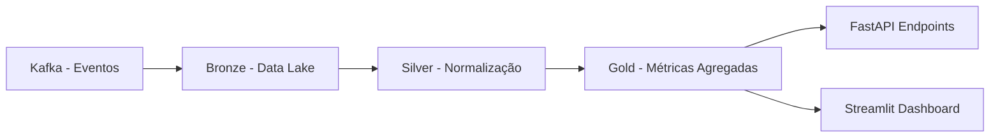

# 📊 SupplyChain Pulse — Real-Time Dataflow

<p align="center">
  <em>Pipeline ETL em tempo real para monitoramento da cadeia de suprimentos</em><br>
  <strong>Kafka | FastAPI | Polars | DuckDB | Streamlit | Pytest</strong>
</p>

---

## 🚀 Visão Geral

O **SupplyChain Pulse** é uma plataforma de **engenharia de dados e backend** que simula o fluxo completo de eventos logísticos em tempo real — desde a ingestão de dados via **Kafka**, passando por **pipelines ETL (Bronze → Silver → Gold)**, até a disponibilização dos insights via **API** e **dashboard interativo em Streamlit**.

Ele cobre **todo o ciclo de dados**:

1. **Ingestão** → Eventos de fornecedores (pedidos, atrasos, alertas de estoque).  
2. **Transformação** → Normalização (Silver) e geração de métricas (Gold).  
3. **Exposição** → API REST com **FastAPI** + Dashboard visual.  
4. **Negócio** → Regras críticas de supply chain:  
   - 🚚 **Pedidos Criados** (volume e evolução temporal).  
   - ⏳ **Atrasos** (impacto e ranking de fornecedores críticos).  
   - ⚠️ **Alertas de Estoque** (níveis mínimos e riscos operacionais).  

---

## 🏗️ Arquitetura



- **Bronze** → ingestão bruta em Parquet.  
- **Silver** → limpeza, deduplicação e normalização de schemas.  
- **Gold** → tabelas métricas para análise de negócio.  

---

## 📂 Estrutura do Projeto


```bash
├── data                         # Dados persistidos pelas camadas do ETL
│   ├── bronze                   # Dados crus ingeridos (via Kafka / arquivos)
│   │   ├── events_2025-09-17.parquet
│   │   └── events_2025-09-18.parquet
│   ├── silver                   # Dados normalizados e limpos (pós-validação)
│   │   ├── silver_events_2025-09-17.parquet
│   │   └── silver_events_2025-09-18.parquet
│   └── gold                     # Métricas e KPIs derivadas para consumo
│       ├── events_2025-09-17
│       │   ├── gold_inventory_alerts.parquet
│       │   ├── gold_orders_created.parquet
│       │   └── gold_orders_delayed.parquet
│       └── events_2025-09-18
│           ├── gold_inventory_alerts.parquet
│           ├── gold_orders_created.parquet
│           └── gold_orders_delayed.parquet
├── docker-compose.yaml           # Orquestração de containers (Kafka, Zookeeper etc.)
├── Makefile                      # Atalhos de automação (lint, test, coverage, etc.)
├── mypy.ini                      # Configuração de tipagem estática (Mypy)
├── poetry.lock                   # Lockfile do Poetry
├── pyproject.toml                # Configurações do Poetry e dependências do projeto
├── README.md                     # Documentação principal
├── src                           # Código-fonte da aplicação
│   ├── data_market_etl           # Placeholder/lib auxiliar
│   ├── orchestrator              # Fluxos de orquestração e agendamento
│   │   ├── flows.py
│   │   └── __init__.py
│   ├── scpulse                   # Módulo principal SupplyChain Pulse
│   │   ├── api                   # Endpoints REST (FastAPI)
│   │   │   ├── routes            # Rotas específicas (health, inventory, orders, suppliers)
│   │   │   └── schemas           # Pydantic models
│   │   ├── domain                # Regras de negócio (ex.: risk rules)
│   │   ├── etl                   # Pipelines ETL (Bronze→Silver→Gold)
│   │   │   ├── bronze_to_silver.py
│   │   │   ├── ingest_stream.py
│   │   │   └── silver_to_gold.py
│   │   ├── pulseboard_visualization # Dashboard em Streamlit (camada Gold)
│   │   │   ├── app.py
│   │   │   └── config.toml
│   │   ├── logging_config.py     # Configuração central de logs
│   │   ├── main.py               # Ponto de entrada da API FastAPI
│   │   └── pipeline.py           # Orquestrador Bronze→Silver→Gold
│   ├── scripts                   # Scripts auxiliares
│   │   ├── factories.py          # Factory Boy: geração de mocks para testes
│   │   └── simulate_suppliers.py # Simulador de fornecedores (eventos)
│   └── storage                   # Persistência em bancos (DuckDB, Postgres)
│       ├── duck.py
│       └── postgres.py
└── tests                         # Testes automatizados (pytest + factories)
    ├── test_etl_silver.py        # Testes Bronze→Silver
    ├── test_etl_gold.py          # Testes Silver→Gold
    ├── test_factories.py         # Testes do Factory Boy
    └── test_sample.py            # Testes básicos

```

---

## 🧪 Testes e Qualidade

- Testes unitários com **pytest** cobrindo:
  - ✅ Bronze → Silver (schema, deduplicação, nulls).  
  - ✅ Silver → Gold (métricas de pedidos, atrasos, estoque).  
  - ✅ Factories (geração de dados mock).  
- Integração no pipeline end-to-end.
- **Mypy** para tipagem estática.  
- **Makefile** com atalhos de produtividade:  

```bash
make setup       # Instala dependências via poetry
make lint        # Lint do código
make format      # Formata automaticamente
make test        # Roda todos os testes
make coverage    # Testes com coverage
make test-gold   # Roda apenas testes da camada Gold
```

---

## 🏭 Uso de Factory Pattern

Para simular fornecedores e eventos reais, o projeto utiliza **Factory Boy**, aplicando o **padrão de projeto Factory**:

- Geração automática de eventos com **faker**.  
- Simulação de **pedidos criados, atrasados e alertas de estoque**.  
- Permite **testes reprodutíveis** e **mock de cenários complexos**.  

Exemplo:  

```python
class OrderFactory(factory.Factory):
    class Meta:
        model = dict

    event_type = "order_created"
    supplier = factory.Faker("company")
    timestamp = factory.LazyFunction(datetime.utcnow)
    qty = factory.Faker("random_int", min=1, max=1000)
```

---

## 📊 Dashboard Interativo

O **Streamlit Pulseboard** transforma métricas em **insights visuais**:

- 📦 Pedidos criados → evolução temporal + KPIs.  
- ⏳ Atrasos → ranking de fornecedores críticos.  
- ⚠️ Estoque → alertas por SKU e thresholds mínimos.  


---

## 🔗 API Endpoints (FastAPI)

### Orders
- `GET /api/orders/summary` → Total, média, evolução temporal.  
- `GET /api/orders/by-supplier`  

### Delays
- `GET /api/delays/summary` → Total de atrasos, média em dias.  
- `GET /api/delays/top-suppliers`  

### Inventory
- `GET /api/inventory/alerts`  
- `GET /api/inventory/by-sku`  

---

## 📦 Tecnologias

- **Python 3.12**  
- **Polars** → ETL ultra-performático.  
- **Kafka** → ingestão em tempo real.  
- **FastAPI** → backend de APIs.  
- **Streamlit + Altair** → visualização interativa.  
- **DuckDB / Postgres** → camada de persistência Gold.  
- **Factory Boy + Pytest** → testes com dados mockados.  
- **Poetry** → gerenciamento de dependências.  
- **Docker Compose** → orquestração local.  

---

## 🌟 Valor de Negócio

- Permite **detectar atrasos críticos antes que impactem clientes**.  
- Apoia **decisões de reposição de estoque**.  
- Gera **KPIs estratégicos** para times de supply chain.  
- Demonstra **boas práticas de Data Engineering**:  
  - Arquitetura **Bronze → Silver → Gold**.  
  - Testes, CI/CD, observabilidade.  
  - Integração de **dados em tempo real + batch**.  

---

<p align="center">Feito com ❤️ e muito ☕ por Vitória Raymara</p>